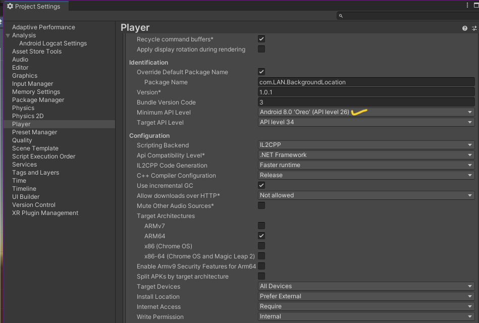
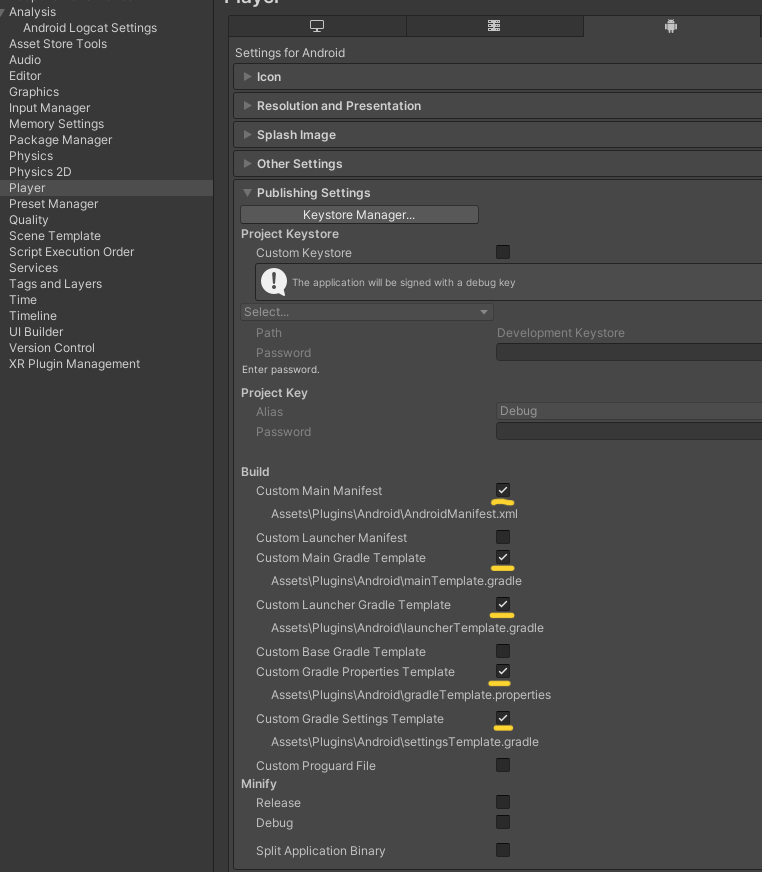
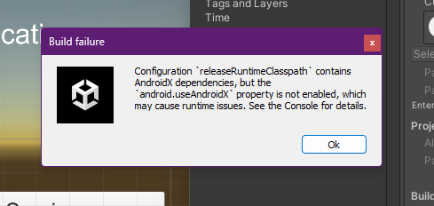
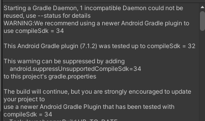
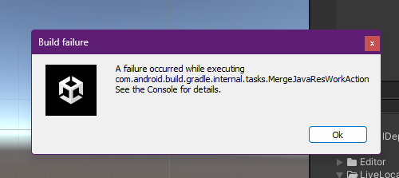
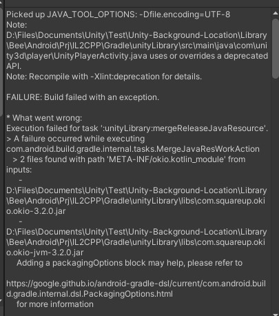

# Unity Background Location

Unity Android - Test background location Plugin

## **Requirements**

1. Install External Dependency Manager for Unity first :

    - Follows [this](https://openupm.com/packages/com.google.external-dependency-manager/#modal-manualinstallation) step.
    - Or, download and import [this](https://github.com/googlesamples/unity-jar-resolver/blob/master/external-dependency-manager-latest.unitypackage) unity package.

2. Make sure minimum API Level set to `API Level 26` :

    

3. Check following build settings :

    

4. Add required-optional permissions to `Assets/Plugins/Android/AndroidManifest.xml` :

    ```XML
    ...
    <manifest xmlns:android="http://schemas.android.com/apk/res/android" package="com.LAN.BackgroundLocation" xmlns:tools="http://schemas.android.com/tools">

    <!-- Required permissions -->
    <uses-permission android:name="android.permission.ACCESS_FINE_LOCATION" />
    <uses-permission android:name="android.permission.ACCESS_COARSE_LOCATION" />
    <uses-permission android:name="android.permission.ACCESS_BACKGROUND_LOCATION" />
    <uses-permission android:name="android.permission.FOREGROUND_SERVICE" />
    <uses-permission android:name="android.permission.FOREGROUND_SERVICE_LOCATION" android:minSdkVersion="29" />
    <!-- Required permissions -->

    <!-- Optional permissions -->
    <uses-permission android:name="android.permission.REQUEST_IGNORE_BATTERY_OPTIMIZATIONS" />
    <!-- Optional permissions -->

    <application>
        <activity android:name="com.unity3d.player.UnityPlayerActivity" android:theme="@style/UnityThemeSelector">
    ...
    ```

5. Insert script below into `Assets\Plugins\Android\launcherTemplate.gradle` :

    ```Gradle
    ...
    android {
        ...
        **PACKAGING_OPTIONS****PLAY_ASSET_PACKS****SPLITS**

        // Requirement for Live Location
        packagingOptions {
            pickFirst('META-INF/okio.kotlin_module')
            pickFirst('META-INF/kotlinx_coroutines_core.version')
        }
        // Requirement for Live Location

        **BUILT_APK_LOCATION**
        ...
    }
    ```

6. Insert script below into `Assets\Plugins\Android\mainTemplate.gradle` :

    ```Gradle
    ...
    // Android Resolver Exclusions End
    android {
        ...
        **PACKAGING_OPTIONS**

        // Requirement for Live Location
        packagingOptions {
            pickFirst('META-INF/okio.kotlin_module')
            pickFirst('META-INF/kotlinx_coroutines_core.version')
        }
        // Requirement for Live Location
    }
    **IL_CPP_BUILD_SETUP**
    ...
    ```

7. Insert script below into `Assets\Plugins\Android\gradleTemplate.properties` :

    ```Properties
    ...
    android.enableJetifier=true
    # Android Resolver Properties End
    **ADDITIONAL_PROPERTIES**

    # Requirement for Live Location
    android.suppressUnsupportedCompileSdk=34
    # Requirement for Live Location
    ```

<br>
<br>

## **Error When Some Build Settings Do Not Match**

1. `Custom Gradle Properties Template` :

    
    
    <br/>
    
    

<br>

2. `Custom Launcher Gradle` and `Custom Main Gradle` :

    
    
    <br/>
    
    

